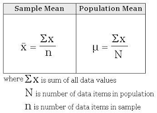

## Types of  statistics: 
********************************
1. **Descriptive Stats :** Analyzing data,Summarizing Data,Organizing Data in form of 
**Number & Graphs**.

Example: Graphs(Bar Plot,Histogram,Pie Chart),Probability Density Function(PDF),Cumulative Debsity Function(CDF), Normal Distribution
- Meausre of Central Tendency (Mean,Median,Mode)
- Measure of Variance (Standard Deviation,variance)
  etc.
  
2. **Inferential Stats :**  From a population after taking samples a that we do some tests and come to an Inference and conclusion.

Example: Suppose the vote has been done in India and we have the population data.Then from that population data we take samples and after that we do some tests and come over a conclusion that which party may get how much percentage vote.

```Population -> Sample -> Tests -> inference & Conclusions ```

- Testings: ( Z Test, T Test,Chi Square Test etc.)
We use ``Confidence Interval``(A confidence interval, in statistics, refers to the probability that a population parameter will fall between a set of values for a certain proportion of times.)
- A confidence interval displays the probability that a parameter will fall between a pair of values around the mean.
- Confidence intervals measure the degree of uncertainty or certainty in a sampling method.
- They are most often constructed using confidence levels of 95% or 99%.

## Population And Sample :
***** 
Let's take an example: Suppose we want to find the avergae height of all the people of a state.let total people is 1 million.


``people of a state`` is population.


Lets we are taking a sample of 10k people from 1 million.




````
Population Mean:
            1 M
μ = (1/1 M) * Σ Xi
            i=1 


Sample Mean:
            1 k
x̄ = (1/1 k) * Σ Xi
            i=1
````
``` Population Mean > Sample Mean ```

## Mean,Median,Mode :
********************************
(To measure the central tendency)

Suppose I have sample : {1,2,3,3,4,5,6,7}
`Mean` :
```
μ = (1+2+3+3+4+5+6+7)/8
  = 3.87  
```
Suppose we have outlier: {1,2,3,3,4,5,6,7,90}

Here 90 is the `Outlier`

We use the median when we have Outliers:
- if we have even numbers of samples we have to take the mid two values and average them.

- If we have odd numbers of sample we have to take the middle value.

Here Median is : 4 .

sample : {1,2,3,3,4,5,6,7}

`Mode`:
If we have any value used frequently in sample then it is called Mode value.

Here Mode: 3 .

We use Mean,Median,Mode: `` To handle missing values`` . we generally use Mean but if we have outliers then we use median and mode.

Example: 
```
We have a sample of age:

                Age
                20
                30
                80
                60
                50
                40
                -
                -

(-) are blank values we dont have any Outliers so we can use Mean here.
Make sure Age is an Independent Variable.

```
## Random Variables & Types :

`Random Variable` is something in which we store values and we can use them where we want:

Example: X=23, Y= Male.( X and Y is Random Variable).

